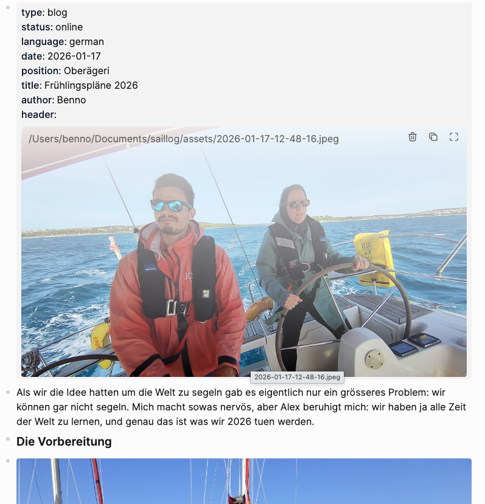

# logseq-to-hugo-converter
Takes a logseq md file and converts special annotated lists to a blog post ready to be served with HUGO.

We use logseq for our log book and wanted to also be able to create blog post right out of the log book. See https://sailingnomads.ch for the blog.

For example, having a logseq page or journal at /logseq-data with following form:



## Usage

### macOS
Requires `fswatch`. Install with: `brew install fswatch`

```bash
./watch-and-convert.sh /logseq-data ../hugo-data/content/posts/ ../hugo-data
```

### Linux/Ubuntu
Requires `inotify-tools`. Install with: `sudo apt install inotify-tools`

```bash
./watch-and-convert-linux.sh /logseq-data ../hugo-data/content/posts/ ../hugo-data
```

The third parameter (git repository) is optional. If provided, changes will be automatically committed and pushed.

Will create a hugo compatible post. Find an example here: [example](2026-01-17_Frühlingspläne_2026/index.md)
