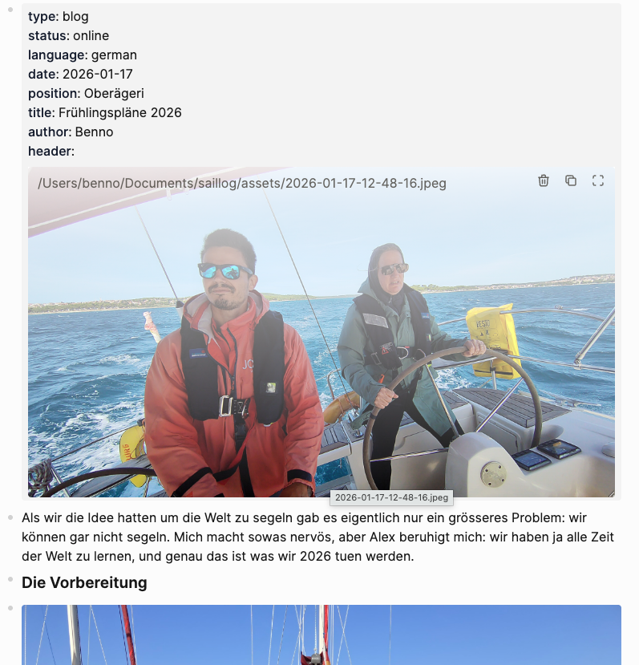
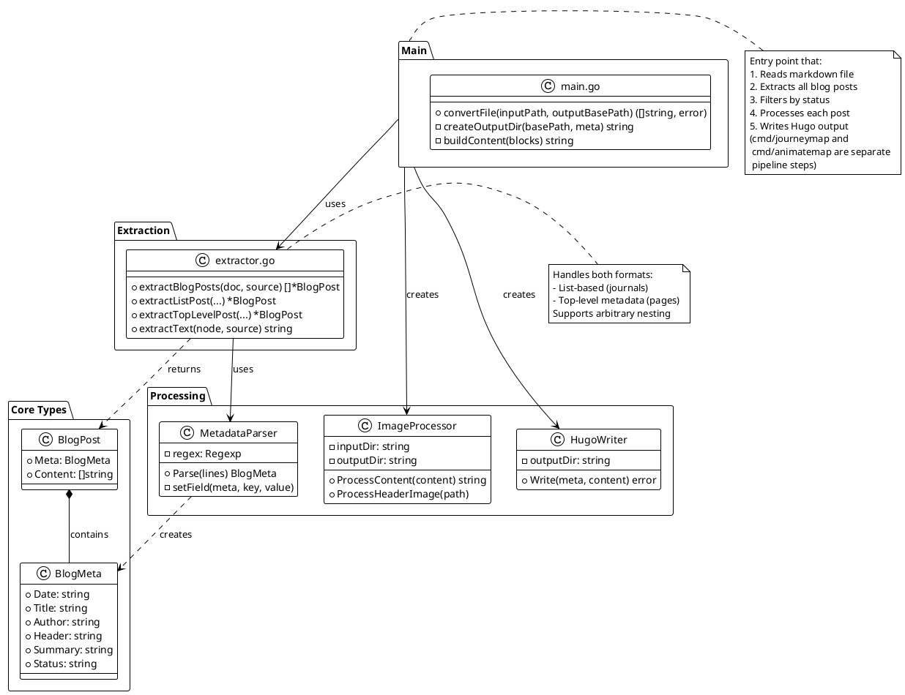

# logseq-to-hugo-converter
Takes a Logseq markdown file and converts specially annotated lists to blog posts ready to be served with Hugo. Includes automatic translation to multiple languages (English, German, Spanish, French, Italian, and Pirate Speak), and generates an animated journey map video from GPS positions recorded in Logseq journals.

We use Logseq for our log book and wanted to also be able to create blog posts right out of the log book, and visualise our sailing route on the homepage. See https://sailingnomads.ch for the blog.

For example, having a logseq page or journal at /logseq-data with following form:



## Installation

### Prerequisites

This converter requires **Go** (Golang) to be installed on your system.

#### Installing Go on macOS

**Option 1: Using Homebrew (Recommended)**
```bash
brew install go
```

**Option 2: Official Installer**
1. Download the macOS installer from [golang.org/dl](https://golang.org/dl/)
2. Open the downloaded `.pkg` file and follow the installation prompts
3. Go will be installed to `/usr/local/go` by default

**Verify Installation:**
```bash
go version
```

#### Installing Go on Linux/Ubuntu

**Option 1: Using apt (Easier, but may not be the latest version)**
```bash
sudo apt update
sudo apt install golang-go
```

**Option 2: Official Binary (Recommended for latest version)**
```bash
# Download and extract (replace 1.22.0 with the latest version from golang.org/dl)
wget https://go.dev/dl/go1.22.0.linux-amd64.tar.gz
sudo rm -rf /usr/local/go
sudo tar -C /usr/local -xzf go1.22.0.linux-amd64.tar.gz

# Add Go to PATH (add this to ~/.bashrc or ~/.profile for persistence)
export PATH=$PATH:/usr/local/go/bin

# Reload your shell configuration
source ~/.bashrc
```

**Verify Installation:**
```bash
go version
```

### Installing Dependencies

Once Go is installed, fetch the required Go modules:

```bash
cd logseq-to-hugo-converter
go mod download
```

### File Watching Tools

The `watch-and-convert.sh` script automatically detects your operating system and uses the appropriate file watching tool. Install the tool for your platform:

#### macOS
Install `fswatch`:
```bash
brew install fswatch
```

#### Linux/Ubuntu
Install `inotify-tools`:
```bash
sudo apt install inotify-tools
```

The script will automatically use the correct tool based on your OS.

### ffmpeg (for the animated journey map)

The `cmd/animatemap` tool assembles the animation frames into an MP4 using `ffmpeg`.

#### macOS
```bash
brew install ffmpeg
```

#### Linux/Ubuntu
```bash
sudo apt install ffmpeg
```

### OpenAI API Key (for automatic translation)

To enable automatic translation of blog posts, you need to set the `OPENAI_API_KEY` environment variable:

```bash
export OPENAI_API_KEY='sk-...'
```

You can get an API key from [OpenAI](https://platform.openai.com/api-keys).

**To make it persistent**, add the export command to your shell configuration:
- macOS/Linux (bash): Add to `~/.bashrc` or `~/.bash_profile`
- macOS/Linux (zsh): Add to `~/.zshrc`

```bash
echo "export OPENAI_API_KEY='sk-...'" >> ~/.zshrc
source ~/.zshrc
```

**Note:** Translation is optional. If the API key is not set, the script will skip translation and only perform conversion.

### Running Tests

To verify the installation and ensure everything is working correctly, run the test suite:

```bash
# Run all tests (core converter + all sub-commands)
go test ./...

# Run tests with verbose output
go test -v ./...
```


## Usage

### Running the File Watcher

The `watch-and-convert.sh` script is cross-platform and works on both macOS and Linux. It automatically detects your operating system and uses the appropriate file watching tool (`fswatch` on macOS, `inotifywait` on Linux).

```bash
./watch-and-convert.sh [-try] <input_directory> <output_directory> [git_repo_directory]
```

**Examples:**
```bash
# Normal mode (with automatic translation and git push)
./watch-and-convert.sh /logseq-data ../hugo-data/content/posts/ ../hugo-data

# Try mode (with automatic translation but no git push - useful for testing)
./watch-and-convert.sh -try /logseq-data ../hugo-data/content/posts/ ../hugo-data
```

**Parameters:**
- `-try` (optional): Do everything except git push (useful for testing)
- `input_directory`: Path to your Logseq data directory
- `output_directory`: Where converted blog posts should be written
- `git_repo_directory` (optional): Git repository to automatically commit and push changes to

**Features:**
- Automatically detects OS (macOS/Linux) and uses the appropriate file watching tool
- Monitors changes in `assets/`, `journals/`, and `pages/` subdirectories
- Waits 30 minutes after detecting changes to batch multiple edits together
- **Automatic translation**: Detects new or changed markdown files and translates them to all supported languages (English, German, Spanish, French, Italian, Pirate Speak)
- Optionally commits and pushes changes to a git repository
- Try mode (`-try` flag) for testing without pushing to remote

**Workflow:**
1. Watches for changes in Logseq directories
2. Converts all markdown files to Hugo format
3. **Generates the animated journey map** — extracts `current-position::` entries from journals, writes `data/journey.json`, and renders `static/journey-map.mp4`
4. **Automatically translates** any new or modified `index.<lang>.md` files using the translation tool
5. Commits all changes (conversions + translations + map, when content also changed)
6. Pushes to remote (unless `-try` flag is used)

> **Note:** If the only files that changed are `data/journey.json` and `static/journey-map.mp4`, the commit is skipped. This avoids triggering a deployment (and its cost) just because your GPS position changed.

### Manual Conversion

You can also convert individual files without the watcher:

```bash
go run . <input_file.md> <output_directory>
```

**Example:**
```bash
go run . examples/journals/2026_01_17.md ./output
```

**Note:** Use `go run .` (dot) to compile all source files, not just `main.go`.

### Automatic Translation

When using the file watcher with a git repository configured, the script automatically translates any new or modified markdown files after conversion. This feature requires:

1. **OpenAI API Key**: Set the `OPENAI_API_KEY` environment variable:
   ```bash
   export OPENAI_API_KEY='sk-...'
   ```

2. **File naming convention**: Only files matching the pattern `index.<lang>.md` are translated (e.g., `index.de.md`, `index.en.md`)

3. **Supported languages**: English (`en`), German (`de`), Spanish (`es`), French (`fr`), Italian (`it`), Pirate Speak (`arrr`)

**How it works:**
- After converting files, the script runs `git status` to detect new or modified `.md` files
- Only changed files are translated (avoiding expensive re-translations)
- For each source file (e.g., `index.de.md`), translations are automatically created for all other languages
- All translations are included in the same git commit

**Manual translation:**
You can also translate individual files manually:
```bash
go run ./cmd/translate <input_file.md>
```

**Example:**
```bash
go run ./cmd/translate 2025-09-13_SKS/index.de.md
```

This translates to all supported languages except the source language.

For more details, see [TRANSLATION_TOOL.md](TRANSLATION_TOOL.md).

### Animated Journey Map

When a git repository is configured, the watcher automatically generates an animated journey map from GPS positions recorded in your Logseq journals.

#### How it works

1. **Record your position** in any journal file using the `current-position::` property:
   ```markdown
   - current-position:: 45.5127,13.5954
   ```
   The position is assumed to be current from that journal date until the next `current-position::` entry appears.

2. **`cmd/journeymap`** scans all journal files, extracts positions, filters out home-base entries (within ~1° of Ticino, Switzerland), merges *consecutive* nearby entries into a single stop (within ~0.1°, roughly the size of a harbour), and writes `data/journey.json`. Returning to a location after leaving it always creates a new stop rather than collapsing into the earlier visit.

3. **`cmd/animatemap`** reads `journey.json` and renders `static/journey-map.mp4`:
   - One logo marker per stop, sized proportionally to duration of stay (30 px for 1-day stays, 100 px for 30+ days)
   - Markers fly in one by one in chronological order, with consecutive fly-ins overlapping for a smooth feel
   - Each marker lands with a brief bounce animation, then holds for a duration proportional to the length of stay
   - Base map tiles fetched from OpenStreetMap via [go-staticmaps](https://github.com/flopp/go-staticmaps); frames assembled into H.264 MP4 by `ffmpeg`

The homepage `<video>` element plays the animation once when it scrolls into view.

#### journey.json format

```json
{
  "positions": [
    { "date": "2026-03-14", "lat": 45.50543, "lng": 13.59597, "days": 4 },
    { "date": "2026-03-18", "lat": 45.15039, "lng": 13.59877, "days": 1 },
    { "date": "2026-03-19", "lat": 45.50591, "lng": 13.59765, "days": 1 }
  ]
}
```

Each entry in `positions` is one distinct stop — consecutive journal entries at the same location are merged, but returning to a location after leaving always produces a new entry.

#### Running the tools manually

```bash
# Step 1 – extract positions from journals
go run ./cmd/journeymap /path/to/logseq/journals /path/to/hugo/data/journey.json

# Step 2 – render the animated map
go run ./cmd/animatemap /path/to/hugo/data/journey.json /path/to/hugo/static/journey-map.mp4
```

### Requirements for Blog Posts

All blog posts must include the following metadata fields:
- `type:: blog` - Marks the content as a blog post
- `status:: online` - Only posts with this status are converted (draft posts are ignored)
- `date:: YYYY-MM-DD` - Publication date
- `title:: Your Title` - Post title
- `author:: Author Name` - Author name
- `header:: ` - (Optional) Featured image

## Supported Formats

The converter supports two different Logseq formats:

### Format 1: Nested List Structure (Journals)

This format is commonly used in Logseq journals where you organize content under topic headings.

```markdown
- [[Blog]]
  - type:: blog
    status:: online
    date:: 2026-01-17
    title:: Spring Plans 2026
    author:: benno
    header:: 
  - First paragraph of content
  - ## Section Heading
  - More content here
  - Another paragraph
```

**Key characteristics:**
- Metadata is in the first list item
- Content follows as subsequent list items
- Each list item becomes a paragraph in the output

**Example:** [examples/journals/2026_01_17.md](examples/journals/2026_01_17.md) → [2026-01-17_Frühlingspläne_2026/index.md](2026-01-17_Frühlingspläne_2026/index.md)

### Format 2: Top-Level Metadata (Pages)

This format places metadata at the top of the file, followed by list items for content.

```markdown
type:: blog
status:: online
date:: 2024-06-14
title:: My Blog Post
author:: Author Name
header:: 

- First paragraph of content
- Second paragraph
- 
- More content
```

**Key characteristics:**
- Metadata fields at the top level (not in a list)
- Content organized as list items below the metadata
- Clean separation between metadata and content

**Example:** [examples/pages/Renan.md](examples/pages/Renan.md) → [2024-06-14_Renan/index.md](2024-06-14_Renan/index.md)

## Software Design

### Architecture

The converter uses a simple, functional approach with clear separation of concerns:


```plantuml
@startuml
!theme plain

package "Core Types" {
  class BlogMeta {
    +Date: string
    +Title: string
    +Author: string
    +Header: string
    +Summary: string
    +Status: string
  }
  
  class BlogPost {
    +Meta: BlogMeta
    +Content: []string
  }
}

package "Extraction" {
  class "extractor.go" as Extractor {
    +extractBlogPosts(doc, source) []*BlogPost
    +extractListPost(...) *BlogPost
    +extractTopLevelPost(...) *BlogPost
    +extractText(node, source) string
  }
}

package "Processing" {
  class MetadataParser {
    -regex: Regexp
    +Parse(lines) BlogMeta
    -setField(meta, key, value)
  }
  
  class ImageProcessor {
    -inputDir: string
    -outputDir: string
    +ProcessContent(content) string
    +ProcessHeaderImage(path)
  }
  
  class HugoWriter {
    -outputDir: string
    +Write(meta, content) error
  }
}

package "Main" {
  class "main.go" as Main {
    +convertFile(inputPath, outputBasePath) ([]string, error)
    -createOutputDir(basePath, meta) string
    -buildContent(blocks) string
  }
}

Main --> Extractor : uses
Main --> ImageProcessor : creates
Main --> HugoWriter : creates
Extractor --> MetadataParser : uses
Extractor ..> BlogPost : returns
BlogPost *-- BlogMeta : contains
MetadataParser ..> BlogMeta : creates

note right of Main
  Entry point that:
  1. Reads markdown file
  2. Extracts all blog posts
  3. Filters by status
  4. Processes each post
  5. Writes Hugo output
  (cmd/journeymap and
   cmd/animatemap are separate
   pipeline steps)
end note

note right of Extractor
  Handles both formats:
  - List-based (journals)
  - Top-level metadata (pages)
  Supports arbitrary nesting
end note

@enduml
```

### File Structure

```
📁 logseq-to-hugo-converter/
├── main.go                    ⭐ Entry point & conversion logic
├── types.go                   📋 Data structures
├── metadata.go                🏷️  Metadata parsing
├── extractor.go               🔍 Blog extraction
├── processors.go              🖼️  Image/video processing
├── writer.go                  📝 Hugo format writing
├── main_test.go               ✅ Core converter tests
├── cmd/
│   ├── translate/             🌍 Translation tool
│   │   ├── translate.go           CLI entry point
│   │   ├── translate_llm.go       OpenAI integration
│   │   ├── translate_parser.go    Markdown parsing
│   │   ├── translate_writer.go    File writing
│   │   └── translate_test.go      Tests
│   ├── journeymap/            🗺️  Position extractor
│   │   ├── journeymap.go          Extracts current-position:: entries,
│   │   │                          filters home, clusters consecutive nearby
│   │   │                          stops, writes journey.json
│   │   └── journeymap_test.go     Tests
│   └── animatemap/            🎬 Animated map renderer
│       ├── animatemap.go          Reads journey.json, renders an MP4
│       │                          animation via go-staticmaps + ffmpeg;
│       │                          markers fly in with bounce effect
│       ├── animatemap_test.go     Tests
│       └── logo.png               Embedded marker logo
├── test-nesting.md            📄 Deep nesting test fixture
├── test-multiple.md           📄 Multiple posts test fixture
└── watch-and-convert.sh       👀 File watcher + pipeline orchestrator
```

### Design Principles

- **Simplicity**: Direct function calls, no unnecessary abstractions
- **Single Responsibility**: Each file has one clear purpose
- **Extensibility**: Easy to add new metadata fields or processing steps
- **Testability**: Pure functions with clear inputs/outputs