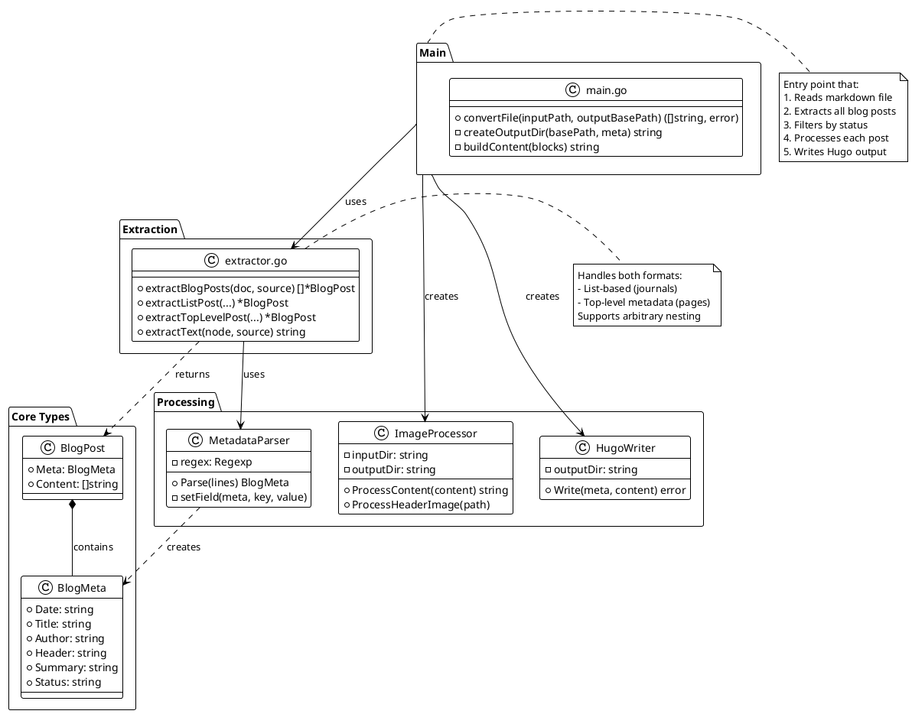

# logseq-to-hugo-converter
Takes a logseq md file and converts special annotated lists to a blog post ready to be served with HUGO.

We use logseq for our log book and wanted to also be able to create blog post right out of the log book. See https://sailingnomads.ch for the blog.

For example, having a logseq page or journal at /logseq-data with following form:


## Installation

### Prerequisites

This converter requires **Go** (Golang) to be installed on your system.

#### Installing Go on macOS

**Option 1: Using Homebrew (Recommended)**
```bash
brew install go
```

**Option 2: Official Installer**
1. Download the macOS installer from [golang.org/dl](https://golang.org/dl/)
2. Open the downloaded `.pkg` file and follow the installation prompts
3. Go will be installed to `/usr/local/go` by default

**Verify Installation:**
```bash
go version
```

#### Installing Go on Linux/Ubuntu

**Option 1: Using apt (Easier, but may not be the latest version)**
```bash
sudo apt update
sudo apt install golang-go
```

**Option 2: Official Binary (Recommended for latest version)**
```bash
# Download and extract (replace 1.22.0 with the latest version from golang.org/dl)
wget https://go.dev/dl/go1.22.0.linux-amd64.tar.gz
sudo rm -rf /usr/local/go
sudo tar -C /usr/local -xzf go1.22.0.linux-amd64.tar.gz

# Add Go to PATH (add this to ~/.bashrc or ~/.profile for persistence)
export PATH=$PATH:/usr/local/go/bin

# Reload your shell configuration
source ~/.bashrc
```

**Verify Installation:**
```bash
go version
```

### Installing Dependencies

Once Go is installed, fetch the required Go modules:

```bash
cd logseq-to-hugo-converter
go mod download
```

### Platform-Specific Tools

#### macOS
Install `fswatch` for file watching:
```bash
brew install fswatch
```

#### Linux/Ubuntu
Install `inotify-tools` for file watching:
```bash
sudo apt install inotify-tools
```

### Running Tests

To verify the installation and ensure everything is working correctly, run the test suite:

```bash
# Run all tests
go test

# Run tests with verbose output
go test -v
```


## Usage

### Running the File Watcher

**On macOS:**
```bash
./watch-and-convert.sh <input_directory> <output_directory> [git_repo_directory]
```

**On Linux/Ubuntu:**
```bash
./watch-and-convert-linux.sh <input_directory> <output_directory> [git_repo_directory]
```

**Example:**
```bash
# macOS
./watch-and-convert.sh /logseq-data ../hugo-data/content/posts/ ../hugo-data

# Linux
./watch-and-convert-linux.sh /logseq-data ../hugo-data/content/posts/ ../hugo-data
```

**Parameters:**
- `input_directory`: Path to your Logseq data directory
- `output_directory`: Where converted blog posts should be written
- `git_repo_directory` (optional): Git repository to automatically commit and push changes to

### Manual Conversion

You can also convert individual files without the watcher:

```bash
go run . <input_file.md> <output_directory>
```

**Example:**
```bash
go run . examples/journals/2026_01_17.md ./output
```

**Note:** Use `go run .` (dot) to compile all source files, not just `main.go`.

### Requirements for Blog Posts

All blog posts must include the following metadata fields:
- `type:: blog` - Marks the content as a blog post
- `status:: online` - Only posts with this status are converted (draft posts are ignored)
- `date:: YYYY-MM-DD` - Publication date
- `title:: Your Title` - Post title
- `author:: Author Name` - Author name
- `header:: ` - (Optional) Featured image

## Supported Formats

The converter supports two different Logseq formats:

### Format 1: Nested List Structure (Journals)

This format is commonly used in Logseq journals where you organize content under topic headings.

```markdown
- [[Blog]]
  - type:: blog
    status:: online
    date:: 2026-01-17
    title:: Spring Plans 2026
    author:: benno
    header:: 
  - First paragraph of content
  - ## Section Heading
  - More content here
  - Another paragraph
```

**Key characteristics:**
- Metadata is in the first list item
- Content follows as subsequent list items
- Each list item becomes a paragraph in the output

**Example:** [examples/journals/2026_01_17.md](examples/journals/2026_01_17.md) → [2026-01-17_Frühlingspläne_2026/index.md](2026-01-17_Frühlingspläne_2026/index.md)

### Format 2: Top-Level Metadata (Pages)

This format places metadata at the top of the file, followed by list items for content.

```markdown
type:: blog
status:: online
date:: 2024-06-14
title:: My Blog Post
author:: Author Name
header:: 

- First paragraph of content
- Second paragraph
- 
- More content
```

**Key characteristics:**
- Metadata fields at the top level (not in a list)
- Content organized as list items below the metadata
- Clean separation between metadata and content

**Example:** [examples/pages/Renan.md](examples/pages/Renan.md) → [2024-06-14_Renan/index.md](2024-06-14_Renan/index.md)

## Software Design

### Architecture

The converter uses a simple, functional approach with clear separation of concerns:



### File Structure

```
📁 logseq-to-hugo-converter/
├── main.go              ⭐ Entry point & conversion logic (144 lines)
├── types.go             📋 Data structures (22 lines)
├── metadata.go          🏷️  Metadata parsing (105 lines)
├── extractor.go         🔍 Blog extraction (204 lines)
├── processors.go        🖼️  Image/video processing (215 lines)
├── writer.go            📝 Hugo format writing (119 lines)
├── main_test.go         ✅ Tests (364 lines)
├── test-nesting.md      📄 Deep nesting test
├── test-multiple.md     📄 Multiple posts test
├── watch-and-convert.sh 👀 macOS watcher
└── watch-and-convert-linux.sh 🐧 Linux watcher
```

**Total:** ~809 lines of code (excluding tests)

### Design Principles

- **Simplicity**: Direct function calls, no unnecessary abstractions
- **Single Responsibility**: Each file has one clear purpose
- **Extensibility**: Easy to add new metadata fields or processing steps
- **Testability**: Pure functions with clear inputs/outputs