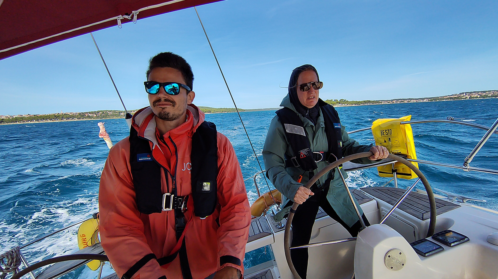

- [[Tagesprogramm]]
	- Iltis D team Essen bei Thomas Amsler in Obere Dattenbergstrasse 11, 6005 Luzern
	- 
- [[Blog]]
	- type:: blog
	  status:: online
	  language:: german
	  date:: 2026-01-17 
	  position:: Oberägeri
	  title:: Frühlingspläne 2026
	  author:: benno
	  header:: 
	- Als wir die Idee hatten um die Welt zu segeln gab es eigentlich nur ein grösseres Problem: wir können gar nicht segeln. Mich macht sowas nervös, aber Alex beruhigt mich: wir haben ja alle Zeit der Welt zu lernen, und genau das ist was wir 2026 tuen werden.
	- ### Die Vorbereitung
	- 
	- Wir wollen verschiedene Arten von Yachten ausprobieren, erstens um Erfahrungen zu sammeln und zweitens, um ein Gefühl zu entwickeln, auf welcher Art von Yacht wir uns vorstellen können zu leben.
	- Solche Yachten kann man einfach mieten, oder chartern wie es korrekt heisst. Voraussetzung dafür ist ein international anerkannter Segelschein und eine Funklizenz. Ich habe im Herbst den deutschen [Sportbootküstenschein](https://en.wikipedia.org/wiki/Sportk%C3%BCstenschifferschein) , SKS, gemacht. Alex machte den RYA Funkschein.
	- ### Der Plan
	- 
	- Ab März werden wir fast 2 Monate in Kroatien verbringen. Kroatien ist die Segeldestination in Europa und mit ausgezeichneter Infrastruktur sehr anfängerfreundlich. Ausserdem ist unsere Segelschule, JoJo München, dort unterwegs.
	- | **Bezeichnung**                   | **Von**    | **Bis**  |
	  | --------------------------------- | ---------- | ---------- |
	  | Skippertraining | 14.03.2026 | 21.03.2026 |
	  | ASA | 21.03.2026 | 27.03.2026 |
	  | Wohnung in Rjieka | 14.03.2026 | 28.03.2026 |
	  | Sun Odyssey 410 | 28.03.2026 | 04.04.2026 |
	  | Sun Odyssey 440 | 04.04.2026 | 11.04.2026 |
	  | Katamarantraining | 11.04.2026 | 18.04.2026 |
	  | Wohnung in Medulin  | 11.04.2026 | 18.04.2026 |
	  | Nautitech 40 Open | 25.04.2026 | 02.05.2026 |
	  | Lagoon 380 Grey Perl | 18.04.2026 | 25.04.2026 |
	- SKS umfasst ein dreitägiger Theoriekurs und eine Woche Praxisturn. Damit fühle ich mich noch nicht sicher genug, um eine Yacht zu führen. Deswegen mache ich erst mal eine Woche [Skippertraining](https://www.jojo-wassersport.de/segeltraining/skippertraining/): Ein Vertiefungskurs für SKSler.
	- Die Woche drauf macht dann Alex ihren Segelschein. Sie hatte keine Lust auf den theorielastigen und schon etwas in die Jahre gekommenen SKS. Sie versucht stattdessen die US-Variante der American Sailing Association, ASA 101, 102, und 104. Die schaffen angeblich Theorie und Praxis in einer Woche. Der Kurs ist in Rjieka wo wir auch für 2 Wochen eine Wohnung gemietet haben.
	- 
	- Da wir unseren Hund Charly dabei haben müssen wir uns abwechseln mit Kursen und Hundehüten. Ich glaube es ist gar nicht so schlecht, wenn wir alleine unterschiedliche Kurse machen, so können wir voneinander profitieren.
	- ### Monohull
	- 
	- Danach haben wir für eine Woche eine Jeanneau Sun Odyssey 410 und dann eine 440 gechartert. Die Sun Odyssey ist das europäische Grossserienboot. Topmodern und zu einem unschlagbaren Preis. Aber diese sogenannten Produktionsboote haben einen schlechten Ruf: sie werden für den Chartermarkt produziert und müssen daher nur wenige Jahre durchhalten. Theoretisch können wir uns ein solches Boot sehr gut vorstellen, mal schauen was die Praxis zeigt.
	- ### Katamaran
	- 
	- Grundsätzlich ganz anders ist ein Katamaran: mit zwei Rümpfen segelt es sich schlechter, d.h. langsamer und man kann nicht so hart an den Wind. Dafür hat man unendlich viel mehr Platz und Komfort. Da es sich anders segelt, und vor allem anders manövriert, haben wir noch eine Woche Katamarankurs bei JoJo gebucht, wobei ich die erste Hälfte der Woche mache und Alex die zweite Hälfte.
	- Dann haben wir eine Nautitec 40, in der Theory bisher unser klarer Favorit, und dann eine Lagoon 380 gebucht. Die Nautitec ist relative selten, die Lagoon dagegen wieder die Grosserie, mit entsprechenden Qualitätsproblemen.
		- here we have a list
		- with two items
	- Wir sind gespannt und denken nach diesen 4 Booten haben wir ein besseres Gefühl dafür was moderne Boote bieten können. Im Herbst wollen wir uns dann auf ein Segment vertiefen und evtl. auch ältere, qualitativ hochwertigere, Boote mieten, aber wir müssen ja als Anfänger nicht gleich ein gutes Boot schrotten.
	- ### Und dann
	- Dann ist schon fast Sommer, und dann wollen wir keine Boote chartern: Ersten herscht Dichtestress und zweites kosten die Boote schnell mal das doppelte in der Hochsaison. Wir werden über Italien nach Griechenland fahren (wegen Charly wollen wir in der EU bleiben). Und dann von Griechenland, Bulgarien, Rumänien, Ungarn, Österreich langsam nach Hause fahren. Unterwegs wird uns noch Mäge irgendwo für ein Stück begleiten.